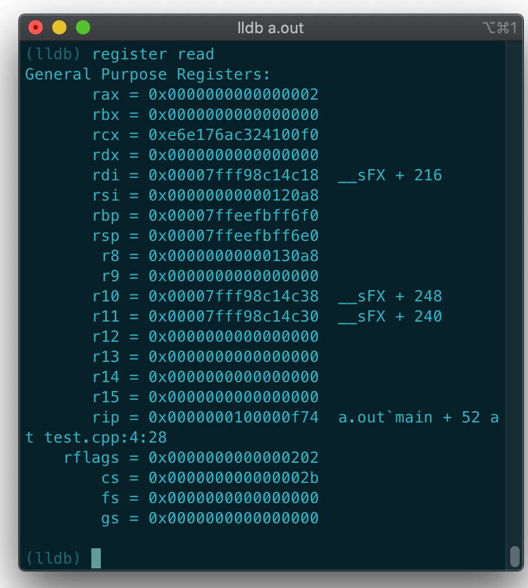

# PA_selflearning

<a href=" https://nju-projectn.github.io/ics-pa-gitbook/ics2019/ "> Refering to NJU PA</a>


# Day1

PA0完成

- [x] installing GNU/Linux
- [x] Learn more about VIM, GDB, tmux


* using GDB/LLDB

could refer to <a href=" https://www.cprogramming.com/gdb.html ">this material</a>

```shell
gcc -g test.cpp
lldb a.out
```
<table>
    <tr>
        <td></td>
        <td></td>
    </tr>
    <tr>
        <td></td>
        <td></td>
    </tr>
    <tr>
        <td></td>
        <td></td>
    </tr>
</table>


* Write Makefile

下面是一个简单的makefile示例

```makefile

hello:hello.c
    gcc hello.c -o hello    # 注意开头的tab, 而不是空格

.PHONY: clean

clean:
    rm hello    # 注意开头的tab, 而不是空格
```

makefile中PHONY的作用

>  你需要键入`make clean`命令来告诉`make`程序执行`clean`规则, 这是因为`make`默认执行在`Makefile`中文本序排在最前面的规则. 但如果很不幸地, 目录下已经存在了一个名为`clean`的文件, 执行`make clean`会得到"文件已经是最新版本"的提示. 解决这个问题的方法是在`Makefile`中加入一行`PHONY: clean`, 用于指示"`clean`是一个伪目标". 这样以后, `make`程序就不会判断目标文件的新旧, 伪目标相应的命令序列总是会被执行. 


* Tmux

Tmux入门: https://linux.cn/article-3952-1.html

我觉得直接vim也还行，并不是很懂这块，我就直接vim了


* Some problems:
  * 在将username加到sudo的时候

```shell
su -   # we still need to switch to the root account first
adduser username sudo  # change `username` to your user name
```

bash: adduser: command not found

解决方法: 

Adding `sbin` to path seems to at least temporarily fix the problem for me:

```
export PATH="$PATH:/sbin:/usr/sbin:usr/local/sbin"
```

Or try executing 

```
/sbin/useradd
```

> 惊了，将username加到了sudo后不知道怎么就一直不能通过sudo访问，重启了之后就好了，估计重启了之后才能起作用


# Day3

PA1部分完成

- [x] `si`, `info r`, `x`简单形式


* 两个陌生函数 `getopt()`, `strtok()`

```cpp
getopt()
```

> 选项字符串：`a:b:cd::e`，由`getopt(argc, argv, "ab:c:de::")`函数的第三个参数指定。
> 选项：分带参和不带参选项 ，执行命令时，选项可有可无，如-b,-c等等。选项后的冒号表示参数，一个冒号就表示这个选项后面必须带有参数，不带参数报错。
>
> could refer to <a href="https://www.cnblogs.com/qingergege/p/5914218.html">this material</a>


```cpp
char *strtok(char *str, const char *delim)
```

> 当strtok()在参数s的字符串中发现参数delim中包含的分割字符时,则会将该字符改为\0 字符。在第一次调用时，strtok()必需给予参数s字符串，往后的调用则将参数s设置成NULL。每次调用成功则返回指向被分割出片段的指针。
>
> could refer to <a href="https://www.runoob.com/cprogramming/c-function-strtok.html">this material</a>


```cpp
parse_args;
init_log;
load_img; 将客户程序从镜像文件读入到客户计算机的内存;
init_isa;

```


* vim terminal中scroll

> If you press `Ctrl + w`, followed by `Shift + n`, it pauses the terminal, and you can navigate it like any buffer. Pressing `i` takes you back into the terminal as you were before.

`:ls` 显示历史， `:buffer n`切到某个会话


* PA1要求实现的命令一览

| 命令         | 格式          | 使用举例          | 说明                                                         |
| ------------ | ------------- | ----------------- | ------------------------------------------------------------ |
| 帮助(1)      | `help`        | `help`            | 打印命令的帮助信息                                           |
| 继续运行(1)  | `c`           | `c`               | 继续运行被暂停的程序                                         |
| 退出(1)      | `q`           | `q`               | 退出NEMU                                                     |
| 单步执行     | `si [N]`      | `si 10`           | 让程序单步执行`N`条指令后暂停执行, 当`N`没有给出时, 缺省为`1` |
| 打印程序状态 | `info SUBCMD` | `info r` `info w` | 打印寄存器状态 打印监视点信息                                |
| 表达式求值   | `p EXPR`      | `p $eax + 1`      | 求出表达式`EXPR`的值, `EXPR`支持的 运算请见[调试中的表达式求值](https://nju-projectn.github.io/ics-pa-gitbook/ics2019/1.6.html)小节 |
| 扫描内存(2)  | `x N EXPR`    | `x 10 $esp`       | 求出表达式`EXPR`的值, 将结果作为起始内存 地址, 以十六进制形式输出连续的`N`个4字节 |
| 设置监视点   | `w EXPR`      | `w *0x2000`       | 当表达式`EXPR`的值发生变化时, 暂停程序执行                   |
| 删除监视点   | `d N`         | `d 2`             | 删除序号为`N`的监视点                                        |

备注:

- (1) 命令已实现
- (2) 与GDB相比, 我们在这里做了简化, 更改了命令的格式


```cpp
static struct {
    char *name;
    char *description;
    int (*handler) (char *);
} cmd_table [] = {
    { "help", "Display informations about all supported commands", cmd_help },
    { "c", "Continue the execution of the program", cmd_c },
    { "q", "Exit NEMU", cmd_q },

    /* TODO*/
    { "si", "Single step execution of N instructions then suspend, usage: si [N], default N = 1", cmd_si},
    { "info", "Usage: info [rw], [r] means print the register, [w] means print the watchpoint", cmd_info},
    { "x", "Scan memory from specific address, usage: x [N] [EXPR], where N represents output N-4bytes successively, and EXPR represents expression whose value will be" 
        "starting address of the scan", cmd_x },
    { "w", "Set watchpoint for expression, usage: w [EXPR]", cmd_w},
    { "d", "Delete watchpoint N, usage: d[N]", cmd_d},
};
```


* Implement `si`

直接调用了现成的`cpu_exec`函数

```cpp
static int cmd_si(char *args) {
    uint64_t stepCount = 1;
    if(args) {
        unsigned long long tmpStep = strtoull(args, NULL, 10);
        if(tmpStep == 0) {
            printf("si command should be 'si [N]', in which N is an unsigned long long number bigger than 0\n");
            return 0;
        }
        stepCount = (uint64_t)tmpStep;
    }
    cpu_exec(stepCount);
    return 0;
}
```


* Implement `info r`

```cpp
static int cmd_info(char* args) {
    char* infoCommand = strtok(NULL, " ");
    if(infoCommand == NULL) {
        printf("Usage: info [rw]\nTry 'help info' for more information.\n");
    } else if(strcmp(infoCommand, "r") == 0) {
        isa_reg_display();
    } else if(strcmp(infoCommand, "w") == 0) {
        /* implement watchpoint */
    } else {
        printf("Usage: info [rw]\nTry 'help info' for more information.\n");
    }
    return 0;
}
```

对应获取打印每一个寄存器的值

```cpp
const char *regsl[] = {
    "$0", "at", "v0", "v1", "a0", "a1", "a2", "a3",
    "t0", "t1", "t2", "t3", "t4", "t5", "t6", "t7",
    "s0", "s1", "s2", "s3", "s4", "s5", "s6", "s7",
    "t8", "t9", "k0", "k1", "gp", "sp", "s8", "ra"
};

void isa_reg_display() {
    for(int i = 0; i < 32; i++) {
        printf("%s\t0x%08x\n", regsl[i], reg_l(i));
    }
}
```

其中`reg_l(index)`就是获取对应寄存器的值，他是一个macro

```cpp
#define reg_l(index) (cpu.gpr[check_reg_index(index)]._32)
```


* Implement `x`

```cpp
static int cmd_x(char* args) {
    char* tmpArg = strtok(NULL, " ");
    if(tmpArg == NULL) {
        printf("Usage: x [N] [EXPR]\nTry 'help x' for more information.\n");
        return 0;
    }
    int byteNum = atoi(tmpArg);
    if(byteNum < 0) {
        printf("N must be an integer and bigger than 0.\n");
        return 0;
    }

    tmpArg = strtok(NULL, " ");
    if(tmpArg == NULL) {
        printf("Usage: x [N] [EXPR]\nTry 'help x' for more information.\n");
        return 0;
    }

    vaddr_t addr = (vaddr_t)strtoul(tmpArg+2, NULL, 16);
    for(int i = 0; i < byteNum; i++) {
        printf("  %x:   :", addr);
        for(int j = 0; j < 4; j++) {
            printf("%02x ", vaddr_read(addr++, 1));
        }
        printf("\n");
    }

    return 0;
}
```


运行

```cpp
(nemu) x 1 0x80100000
  80100000:   :00 80 04 3c 
(nemu) x 2 0x80100000
  80100000:   :00 80 04 3c 
  80100004:   :00 00 80 ac 
```


